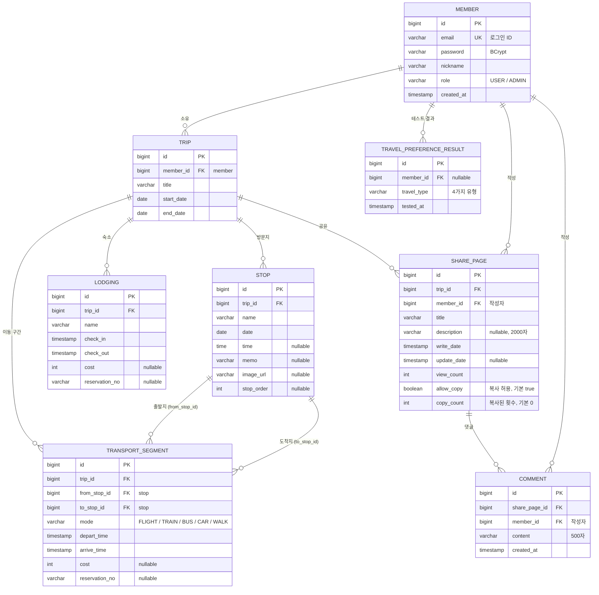

# ERD

테이블은 JPA 엔티티에서 `ddl-auto: update`로 자동 생성됩니다.
컬럼이나 관계를 바꾸면 이 문서도 같은 PR에서 같이 고칩니다.

## 테이블 요약

| 테이블 | 엔티티 | 패키지 | 설명 |
|--------|--------|--------|------|
| member | Member | member | 회원. 로그인 ID는 이메일 |
| trip | Trip | trip | 여행 계획 (여행의 주인 = member) |
| stop | Stop | trip | 여행의 방문지, `stop_order`로 순서 |
| transport_segment | TransportSegment | trip | 방문지 → 방문지 이동 구간 |
| lodging | Lodging | trip | 여행의 숙소 |
| share_page | SharePage | share | 여행 계획을 공유한 게시글 |
| comment | Comment | share | 게시글 댓글 |
| travel_preference_result | TravelPreferenceResult | traveltest | 여행 성향 테스트 결과 (여러 번 하면 여러 건) |

## 제약 조건

| 테이블 | 제약 | 목적 |
|--------|------|------|
| member | UNIQUE(email) | 같은 이메일 중복 가입 방지 (B8) |
| trip, share_page, comment | member_id NOT NULL | 주인 · 작성자가 없는 데이터 방지 |
| stop, transport_segment, lodging | trip_id NOT NULL | 여행에 속하지 않는 데이터 방지 |
| transport_segment | from_stop_id, to_stop_id NOT NULL | 출발지 · 도착지 필수 |

값 범위(날짜 순서, 0 이상)는 DB 제약이 아니라 서버 검증으로 막습니다 (B5~B7).

## 관계 요약
- member 1 : N trip, trip 1 : N stop / transport_segment / lodging
- stop 1 : N transport_segment (출발지, 도착지 각각)
- trip 1 : N share_page, share_page 1 : N comment
- member 1 : N share_page / comment (작성자), member 1 : N travel_preference_result

## 규칙과 데이터의 연결

| 규칙 | 데이터에서 확인하는 방법 |
|------|--------------------------|
| B2 | 요청한 사용자 이메일 = `trip.member_id`의 `member.email` (하위 데이터는 `trip_id`로 거슬러 올라가 확인) |
| B3 | 요청한 사용자 이메일 = `share_page.member_id` / `comment.member_id`의 `member.email` |
| B4 | 공유하려는 `trip.member_id` = 로그인한 사용자 |
| B5 | `trip.start_date ≤ trip.end_date` |
| B6 | `depart_time ≤ arrive_time`, `check_in ≤ check_out` |
| B7 | `cost ≥ 0`, `stop_order ≥ 0` |
| B8 | `member.email` UNIQUE |
| B10 | `transport_segment.from_stop_id` · `to_stop_id`의 `stop.trip_id`가 본인 여행 |
| B11 | `share_page.allow_copy` = true 이거나, 요청한 사용자가 `share_page.member_id`(작성자) |
| B12 | 복사한 `transport_segment` · `lodging`의 `reservation_no`는 NULL |

## 삭제 규칙

부모를 삭제하면 하위 데이터도 함께 삭제됩니다. DB의 `ON DELETE CASCADE`가 아니라 서비스 코드에서 하위 데이터부터 순서대로 지웁니다.

| 삭제 대상 | 함께 삭제되는 데이터 | 처리 위치 |
|-----------|----------------------|-----------|
| trip | comment(공유 게시글의 댓글) → share_page → transport_segment → lodging → stop | `TripServiceImpl.delete` |
| stop | 이 방문지를 출발지 · 도착지로 쓰는 transport_segment | `StopServiceImpl.delete` |
| share_page | comment | `SharePageServiceImpl.delete` |

여행을 삭제하면 그 여행을 공유한 게시글과, 게시글에 달린 **다른 사람의 댓글**도 함께 삭제됩니다.
새 테이블이 부모 테이블을 참조하게 되면 위 서비스의 삭제 순서에도 추가해야 합니다.

## 변경 이력

| 날짜 | 변경 | 이유 |
|------|------|------|
| 2026-09-30 | `trip.user_id`, `share_page.writer_id`, `comment.writer_id`(문자열) 삭제 → `member_id`(FK)로 교체 | 로그인한 회원과 연결해서 본인 확인(B2 · B3)을 하기 위해 |
| 2026-09-30 | 삭제 시 하위 데이터 함께 삭제 ([#7](https://github.com/yncteamproject/Triplan/issues/7)) | 하위 데이터가 있으면 외래키 때문에 500 에러가 나던 문제(K1) 해결 |
| 2026-10-06 | `share_page.description` 255 → 2000자, `comment.content` 255 → 500자 ([#8](https://github.com/yncteamproject/Triplan/issues/8)) | 검증은 통과하는데 DB 컬럼이 짧아 500 에러가 나던 문제(K2) 해결 |
| 2026-10-06 | `share_page.allow_copy`(기본 true), `share_page.copy_count`(기본 0) 추가 ([#15](https://github.com/yncteamproject/Triplan/issues/15)) | 공유된 여행 복사(S5)와 복사 허용 설정(B11)을 위해. 기존 행이 있어 NOT NULL + 기본값으로 추가 |
